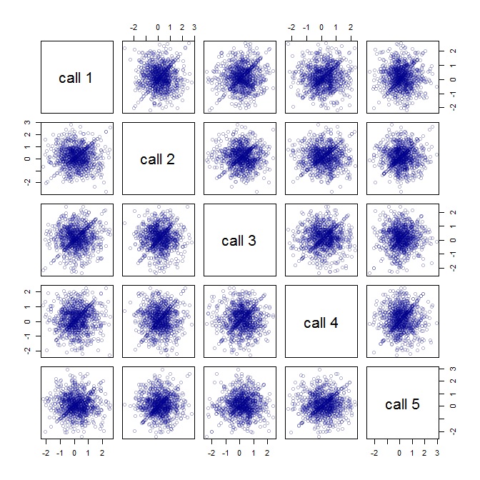

Untitled
================
Eric Buhle
5/14/2019

``` r
if(.Platform$OS.type == "windows") options(device=windows)
options(mc.cores = parallel::detectCores(logical = FALSE) - 1)
library(yarrr)
```

    ## Loading required package: jpeg

    ## Loading required package: BayesFactor

    ## Loading required package: coda

    ## Loading required package: Matrix

    ## ************
    ## Welcome to BayesFactor 0.9.12-4.2. If you have questions, please contact Richard Morey (richarddmorey@gmail.com).
    ## 
    ## Type BFManual() to open the manual.
    ## ************

    ## Loading required package: circlize

    ## ========================================
    ## circlize version 0.4.6
    ## CRAN page: https://cran.r-project.org/package=circlize
    ## Github page: https://github.com/jokergoo/circlize
    ## Documentation: http://jokergoo.github.io/circlize_book/book/
    ## 
    ## If you use it in published research, please cite:
    ## Gu, Z. circlize implements and enhances circular visualization 
    ##   in R. Bioinformatics 2014.
    ## ========================================

    ## yarrr v0.1.5. Citation info at citation('yarrr'). Package guide at yarrr.guide()

    ## Email me at Nathaniel.D.Phillips.is@gmail.com

``` r
library(rstan)
```

    ## Loading required package: ggplot2

    ## 
    ## Attaching package: 'ggplot2'

    ## The following object is masked from 'package:yarrr':
    ## 
    ##     diamonds

    ## Loading required package: StanHeaders

    ## rstan (Version 2.18.2, GitRev: 2e1f913d3ca3)

    ## For execution on a local, multicore CPU with excess RAM we recommend calling
    ## options(mc.cores = parallel::detectCores()).
    ## To avoid recompilation of unchanged Stan programs, we recommend calling
    ## rstan_options(auto_write = TRUE)

    ## For improved execution time, we recommend calling
    ## Sys.setenv(LOCAL_CPPFLAGS = '-march=native')
    ## although this causes Stan to throw an error on a few processors.

    ## 
    ## Attaching package: 'rstan'

    ## The following object is masked from 'package:coda':
    ## 
    ##     traceplot

``` r
library(loo)
```

    ## This is loo version 2.1.0.
    ## **NOTE: As of version 2.0.0 loo defaults to 1 core but we recommend using as many as possible. Use the 'cores' argument or set options(mc.cores = NUM_CORES) for an entire session. Visit mc-stan.org/loo/news for details on other changes.

    ## **NOTE for Windows 10 users: loo may be very slow if 'mc.cores' is set in your .Rprofile file (see https://github.com/stan-dev/loo/issues/94).

    ## 
    ## Attaching package: 'loo'

    ## The following object is masked from 'package:rstan':
    ## 
    ##     loo

    ## The following object is masked from 'package:BayesFactor':
    ## 
    ##     compare

``` r
library(shinystan)
```

    ## Loading required package: shiny

    ## 
    ## This is shinystan version 2.5.0

``` r
library(rstanarm)
```

    ## Loading required package: Rcpp

    ## rstanarm (Version 2.18.2, packaged: 2018-11-08 22:19:38 UTC)

    ## - Do not expect the default priors to remain the same in future rstanarm versions.

    ## Thus, R scripts should specify priors explicitly, even if they are just the defaults.

    ## - For execution on a local, multicore CPU with excess RAM we recommend calling

    ## options(mc.cores = parallel::detectCores())

    ## - Plotting theme set to bayesplot::theme_default().

    ## 
    ## Attaching package: 'rstanarm'

    ## The following object is masked from 'package:loo':
    ## 
    ##     kfold

    ## The following object is masked from 'package:rstan':
    ## 
    ##     loo

``` r
library(brms)
```

    ## Loading 'brms' package (version 2.8.0). Useful instructions
    ## can be found by typing help('brms'). A more detailed introduction
    ## to the package is available through vignette('brms_overview').

    ## 
    ## Attaching package: 'brms'

    ## The following objects are masked from 'package:rstanarm':
    ## 
    ##     dirichlet, exponential, get_y, kfold, lasso, ngrps

    ## The following object is masked from 'package:rstan':
    ## 
    ##     loo

``` r
library(Hmisc)
```

    ## Loading required package: lattice

    ## Loading required package: survival

    ## 
    ## Attaching package: 'survival'

    ## The following object is masked from 'package:brms':
    ## 
    ##     kidney

    ## Loading required package: Formula

    ## 
    ## Attaching package: 'Hmisc'

    ## The following objects are masked from 'package:base':
    ## 
    ##     format.pval, units

``` r
library(matrixStats)
library(here)
```

    ## here() starts at C:/Users/Buhle/My Application Data/R/cohoPSM

``` r
source(here("analysis","stan_mean.R"))
source(here("analysis","extract1.R"))
source(here("analysis","cohoPSM1_data.R"))  # read and wrangle data
# load previously saved stanfit objects and don't 
# re-evaluate the corresponding code chunks
if(file.exists(here("analysis","results","stan_psm.RData"))) {
  load(here("analysis","results","stan_psm.RData"))
  eval_stan_psm <- FALSE
}
if(file.exists(here("analysis","results","glmm_psm.RData"))) {
  load(here("analysis","results","glmm_psm.RData"))
  eval_glmm_psm <- FALSE
}
```

``` r
if(.Platform$OS.type == "windows") options(device=windows)
options(mc.cores = parallel::detectCores(logical = FALSE) - 1)
library(yarrr)
library(rstan)
library(loo)
library(shinystan)
library(rstanarm)
library(brms)
library(Hmisc)
library(matrixStats)
library(here)
source(here("analysis","stan_mean.R"))
source(here("analysis","extract1.R"))
source(here("analysis","cohoPSM1_data.R"))  # read and wrangle data
# load previously saved stanfit objects and don't 
# re-evaluate the corresponding code chunks
if(file.exists(here("analysis","results","stan_psm.RData"))) {
  load(here("analysis","results","stan_psm.RData"))
  eval_stan_psm <- FALSE
}
if(file.exists(here("analysis","results","glmm_psm.RData"))) {
  load(here("analysis","results","glmm_psm.RData"))
  eval_glmm_psm <- FALSE
}
```

\==================================================================
HIERARCHICAL REGRESSION MODELS FOR LANDSCAPE DATA AND PSM
================================================================== The
following minimal example demonstrates how
`rstanarm::posterior_linpred()`, and presumably
`rstanarm::posterior_predict()`, handle *new levels* of grouping factors
that define group-varying parameters. The documentation says that in
this case the predictions “marginalize over the relevant variables”, but
it’s not clear whether that means marginalizing over the
*hyperparameters* by drawing new $group-level parameters (as in
`lme4::simulate` with `re.form = NA`), or marginalizing over the
*group-level effects* themselves. Annoyingly for us, it appears to be
the latter. Let’s have a look.

``` r
set.seed(123)
dat <- data.frame(group = gl(10, 5), y = rnorm(10)[rep(1:10, each = 5)] + rnorm(50))
lmm <- stan_lmer(y ~ 1 + (1|group), data = dat, chains = 1, seed = 456)
```

    ## 
    ## SAMPLING FOR MODEL 'continuous' NOW (CHAIN 1).
    ## Chain 1: 
    ## Chain 1: Gradient evaluation took 0 seconds
    ## Chain 1: 1000 transitions using 10 leapfrog steps per transition would take 0 seconds.
    ## Chain 1: Adjust your expectations accordingly!
    ## Chain 1: 
    ## Chain 1: 
    ## Chain 1: Iteration:    1 / 2000 [  0%]  (Warmup)
    ## Chain 1: Iteration:  200 / 2000 [ 10%]  (Warmup)
    ## Chain 1: Iteration:  400 / 2000 [ 20%]  (Warmup)
    ## Chain 1: Iteration:  600 / 2000 [ 30%]  (Warmup)
    ## Chain 1: Iteration:  800 / 2000 [ 40%]  (Warmup)
    ## Chain 1: Iteration: 1000 / 2000 [ 50%]  (Warmup)
    ## Chain 1: Iteration: 1001 / 2000 [ 50%]  (Sampling)
    ## Chain 1: Iteration: 1200 / 2000 [ 60%]  (Sampling)
    ## Chain 1: Iteration: 1400 / 2000 [ 70%]  (Sampling)
    ## Chain 1: Iteration: 1600 / 2000 [ 80%]  (Sampling)
    ## Chain 1: Iteration: 1800 / 2000 [ 90%]  (Sampling)
    ## Chain 1: Iteration: 2000 / 2000 [100%]  (Sampling)
    ## Chain 1: 
    ## Chain 1:  Elapsed Time: 0.146 seconds (Warm-up)
    ## Chain 1:                0.16 seconds (Sampling)
    ## Chain 1:                0.306 seconds (Total)
    ## Chain 1:

``` r
lmm
```

    ## stan_lmer
    ##  family:       gaussian [identity]
    ##  formula:      y ~ 1 + (1 | group)
    ##  observations: 50
    ## ------
    ##             Median MAD_SD
    ## (Intercept) 0.1    0.3   
    ## 
    ## Auxiliary parameter(s):
    ##       Median MAD_SD
    ## sigma 1.0    0.1   
    ## 
    ## Error terms:
    ##  Groups   Name        Std.Dev.
    ##  group    (Intercept) 0.90    
    ##  Residual             0.96    
    ## Num. levels: group 10 
    ## 
    ## Sample avg. posterior predictive distribution of y:
    ##          Median MAD_SD
    ## mean_PPD 0.1    0.2   
    ## 
    ## ------
    ## * For help interpreting the printed output see ?print.stanreg
    ## * For info on the priors used see ?prior_summary.stanreg

``` r
lp_fixef <- posterior_linpred(lmm, newdata = data.frame(group = 9:12), re.form = NA)
head(lp_fixef)
```

    ##           
    ## iterations           1           2           3           4
    ##       [1,] -0.02083969 -0.02083969 -0.02083969 -0.02083969
    ##       [2,]  0.53738799  0.53738799  0.53738799  0.53738799
    ##       [3,]  0.01922550  0.01922550  0.01922550  0.01922550
    ##       [4,] -0.22630368 -0.22630368 -0.22630368 -0.22630368
    ##       [5,] -0.04613319 -0.04613319 -0.04613319 -0.04613319
    ##       [6,]  0.62714095  0.62714095  0.62714095  0.62714095

``` r
lp_ranef <- posterior_linpred(lmm, newdata = data.frame(group = 9:12), re.form = ~ (1|group))
head(lp_ranef)
```

    ##           
    ## iterations          1          2          3          4
    ##       [1,] -0.5571064 -0.6122898  1.1493407  1.1493407
    ##       [2,]  0.3532637 -0.6898502  0.1959857  0.1959857
    ##       [3,] -0.2742512 -0.5135076 -0.2595894 -0.2595894
    ##       [4,] -0.3304370  0.3339022  0.8375255  0.8375255
    ##       [5,] -1.2692123 -0.1669316 -0.5386322 -0.5386322
    ##       [6,]  0.6217414 -0.3438555 -0.3186489 -0.3186489

``` r
lp_ranef <- posterior_linpred(lmm, newdata = data.frame(group = 9:12), re.form = ~ (1|group))
head(lp_ranef)
```

    ##           
    ## iterations          1          2          3          4
    ##       [1,] -0.5571064 -0.6122898  1.1493407  1.1493407
    ##       [2,]  0.3532637 -0.6898502  0.1959857  0.1959857
    ##       [3,] -0.2742512 -0.5135076 -0.2595894 -0.2595894
    ##       [4,] -0.3304370  0.3339022  0.8375255  0.8375255
    ##       [5,] -1.2692123 -0.1669316 -0.5386322 -0.5386322
    ##       [6,]  0.6217414 -0.3438555 -0.3186489 -0.3186489

The first two columns in `newdata` correspond to groups present in the
original sample, while the next two correspond to previously unobserved
groups. With `re.form = NA`, the group-level effects are set to `0` and
the prediction for all groups is the hyper-mean (`(Intercept)`). It’s
not clear what `re.form = ~ (1|group)` is doing. It’s not using the
hyper-mean, but the two new groups are identical, and repeated calls
give the same result. Maybe it’s drawing a *single* new group-level
intercept at each posterior *sample*? Looks like I’ll have to put this
one to the Stan forums.

Let’s take it from the top, this time using `brms` and `predict()`
instead of `rstanarm` and `posterior_linpred()`

``` r
set.seed(123)
dat <- data.frame(group = gl(10, 5), y = rnorm(10)[rep(1:10, each = 5)] + rnorm(50))
lmm <- brm(y ~ 1 + (1|group), data = dat, chains = 1, seed = 456)
```

    ## Compiling the C++ model

    ## Start sampling

    ## 
    ## SAMPLING FOR MODEL 'b2498ca8949c7b2391fa06ba0f2f9258' NOW (CHAIN 1).
    ## Chain 1: 
    ## Chain 1: Gradient evaluation took 0 seconds
    ## Chain 1: 1000 transitions using 10 leapfrog steps per transition would take 0 seconds.
    ## Chain 1: Adjust your expectations accordingly!
    ## Chain 1: 
    ## Chain 1: 
    ## Chain 1: Iteration:    1 / 2000 [  0%]  (Warmup)
    ## Chain 1: Iteration:  200 / 2000 [ 10%]  (Warmup)
    ## Chain 1: Iteration:  400 / 2000 [ 20%]  (Warmup)
    ## Chain 1: Iteration:  600 / 2000 [ 30%]  (Warmup)
    ## Chain 1: Iteration:  800 / 2000 [ 40%]  (Warmup)
    ## Chain 1: Iteration: 1000 / 2000 [ 50%]  (Warmup)
    ## Chain 1: Iteration: 1001 / 2000 [ 50%]  (Sampling)
    ## Chain 1: Iteration: 1200 / 2000 [ 60%]  (Sampling)
    ## Chain 1: Iteration: 1400 / 2000 [ 70%]  (Sampling)
    ## Chain 1: Iteration: 1600 / 2000 [ 80%]  (Sampling)
    ## Chain 1: Iteration: 1800 / 2000 [ 90%]  (Sampling)
    ## Chain 1: Iteration: 2000 / 2000 [100%]  (Sampling)
    ## Chain 1: 
    ## Chain 1:  Elapsed Time: 0.107 seconds (Warm-up)
    ## Chain 1:                0.083 seconds (Sampling)
    ## Chain 1:                0.19 seconds (Total)
    ## Chain 1:

``` r
lmm
```

    ##  Family: gaussian 
    ##   Links: mu = identity; sigma = identity 
    ## Formula: y ~ 1 + (1 | group) 
    ##    Data: dat (Number of observations: 50) 
    ## Samples: 1 chains, each with iter = 2000; warmup = 1000; thin = 1;
    ##          total post-warmup samples = 1000
    ## 
    ## Group-Level Effects: 
    ## ~group (Number of levels: 10) 
    ##               Estimate Est.Error l-95% CI u-95% CI Eff.Sample Rhat
    ## sd(Intercept)     0.96      0.34     0.47     1.78        232 1.00
    ## 
    ## Population-Level Effects: 
    ##           Estimate Est.Error l-95% CI u-95% CI Eff.Sample Rhat
    ## Intercept     0.12      0.34    -0.51     0.82        272 1.00
    ## 
    ## Family Specific Parameters: 
    ##       Estimate Est.Error l-95% CI u-95% CI Eff.Sample Rhat
    ## sigma     0.97      0.12     0.77     1.22        646 1.00
    ## 
    ## Samples were drawn using sampling(NUTS). For each parameter, Eff.Sample 
    ## is a crude measure of effective sample size, and Rhat is the potential 
    ## scale reduction factor on split chains (at convergence, Rhat = 1).

``` r
lp_fixef <- fitted(lmm, newdata = data.frame(group = 9:12), re_formula = NA, summary = FALSE)
head(lp_fixef)
```

    ##             [,1]        [,2]        [,3]        [,4]
    ## [1,] -0.17265460 -0.17265460 -0.17265460 -0.17265460
    ## [2,]  0.05538161  0.05538161  0.05538161  0.05538161
    ## [3,]  0.45411628  0.45411628  0.45411628  0.45411628
    ## [4,]  0.91616372  0.91616372  0.91616372  0.91616372
    ## [5,]  0.88080762  0.88080762  0.88080762  0.88080762
    ## [6,]  0.73683333  0.73683333  0.73683333  0.73683333

``` r
lp_ranef <- fitted(lmm, newdata = data.frame(group = 9:12), re_formula = ~ (1|group), 
                   allow_new_levels = TRUE, summary = FALSE)
head(lp_ranef)
```

    ##             [,1]       [,2]        [,3]        [,4]
    ## [1,] -0.05928694 -0.6089024 -0.93606487 -0.93606487
    ## [2,] -0.38115346 -0.5122476  1.26790895  1.26790895
    ## [3,] -0.25863350 -0.1941662 -1.23376434 -1.23376434
    ## [4,] -0.41795060 -0.5755822 -1.28131712 -1.28131712
    ## [5,] -0.62643325 -0.5263588 -0.05168742 -0.05168742
    ## [6,] -0.51995236 -0.3914476  0.45566188  0.45566188

``` r
lp_ranef <- fitted(lmm, newdata = data.frame(group = 9:12), re_formula = ~ (1|group), 
                   allow_new_levels = TRUE, summary = FALSE)
head(lp_ranef)
```

    ##             [,1]       [,2]       [,3]       [,4]
    ## [1,] -0.05928694 -0.6089024 -0.5490826 -0.5490826
    ## [2,] -0.38115346 -0.5122476  0.2093282  0.2093282
    ## [3,] -0.25863350 -0.1941662  1.5220205  1.5220205
    ## [4,] -0.41795060 -0.5755822  1.2254402  1.2254402
    ## [5,] -0.62643325 -0.5263588  0.9015027  0.9015027
    ## [6,] -0.51995236 -0.3914476 -0.5199524 -0.5199524

OK, so apparently `predict()` is generating new groups’ values from the
hyperdistribution (good) but reusing the same values for every new group
(bad). However, it does appear to draw new values each time it’s called,
which suggests we could hack it by calling it repeatedly over all the
new groups. Except…there’s something fishy about that second call. The
first new value is suspiciously similar to that of group 10 (column 2).
Let’s try a few more, focusing on just a single new
group.

``` r
lp_ranef <- sapply(1:5, function(i) fitted(lmm, newdata = data.frame(group = 11), re_formula = ~ (1|group), 
                                           allow_new_levels = TRUE, summary = FALSE))
head(lp_ranef)
```

    ##             [,1]       [,2]        [,3]       [,4]       [,5]
    ## [1,] -0.05928694  0.4285775  0.97381856 -0.6089024 -0.5490826
    ## [2,]  0.60007306 -0.5122476  0.60007306  0.8393447 -0.3811535
    ## [3,]  1.88641731  1.5220205 -0.25863350 -0.2586335 -0.2586335
    ## [4,] -0.53169948 -0.1943888 -1.28131712 -0.4179506 -0.5755822
    ## [5,]  0.90150275 -0.3340378 -0.05168742 -1.5604073 -0.6264333
    ## [6,]  0.45566188  0.4556619 -0.39144755  1.1054206  0.2094281

What’s going on here? Several of these values are almost identical to
each other and/or to values returned above for previously observed
groups. Am I seeing things? Nope, a pairs plot of these “randomly
generated” values shows some distinctly nonrandom
pattern:

``` r
pairs(lp_ranef, col = transparent("darkblue", 0.7), labels = paste("call", 1:5))
```



Unless and until this is resolved, it looks like we’re stuck with
generating the linear predictor for new observation-level random effects
by brute force. We can do this in `rstanarm` by adding residuals drawn
from the hyperdistribution to the output of `posterior_linpred()` called
with a `re.form` that leaves out the observation-level term(s) in
question. This kludgy solution is limited to the case of random effects
on the intercept (vs. the
slopes).

``` r
# Function to simulate from the posterior distribution of the linear predictor,
# including group-varying intercepts for new groups not included in the fitted data
posterior_linpred_newgroups <- function(object, newdata) 
{
  lp <- matrix(NA, nrow(as.matrix(object)), nrow(newdata))
  re <- ranef(object)
  re_form <- lme4::findbars(formula(object))  # all random effect terms
  # rows of newdata that have new levels of any grouping factors
  newgroups <- sapply(names(re), function(f) {
    ng <- !(newdata[,f] %in% rownames(re[[f]]))
    if(any(ng) & any(colnames(re[[f]]) != "(Intercept)"))
      stop("New groups allowed only allowed for term (Intercept)") else {
        ## won't work with sapply ## re_form <- re_form - formula(paste0("~ (1|", f, ")"))
        return(ng)
      }
    })
  if(!all(newgroups))
    lp[,!newgroups] <- posterior_linpred(object, newdata = newdata[!newgroups,,drop = FALSE])
  if(any(newgroups)) {
    lp[,newgroups] <- posterior_linpred(object, newdata = newdata[i,,drop = FALSE], 
                                        re.form = re_form)
    ## ...and then somehow add random effects generated from the hyperdistributions corresponding
    ## to the discarded group-level intercepts???
  }
  return(lp)
}
```

Arrgh, this is too convoluted for what is still a hacky and inflexible
solution. Might as well just tailor it specifically for the PSM GLMM
case. The following function calculates the marginal log-likelihood of
observed PSM frequencies from a fitted `stanreg` object by Monte Carlo
integration over the observation-level residuals.

``` r
get_LL_glmm_psm <- function(object, data = NULL, N_MC = 1000)
{
  if(is.null(data)) data <- object$data
  # random effects-only formula
  re_formula <- reformulate(sapply(lme4::findbars(formula(object)),
                                   function(f) paste("(", deparse(f), ")")))
  # drop obs-level random effect (assumes re_formula contains other random terms)
  re_formula <- update(re_formula, ~ . - (1|ID))
  # posterior draws of linear predictor without obs-level random effect
  lp <- posterior_linpred(object, newdata = data, re.form = re_formula)
  # generate new obs-level residuals, calculate log of marginal likelihood
  sigma_psm <- as.matrix(object, regex_pars= "Sigma\\[ID")
  LL <- sapply(1:nrow(data), function(i) {
    resid_psm_mc <- matrix(rnorm(nrow(sigma_psm)*N_MC, 0, sigma_psm), nrow(sigma_psm), N_MC)
    p_psm_mc <- plogis(lp[,i] + resid_psm_mc)
    LL_psm_mc <- dbinom(data$n_psm[i], data$n[i], p_psm_mc, log = TRUE)
    return(matrixStats::rowLogSumExps(LL_psm_mc) - log(N_MC))
  })
}
```

``` r
get_LL_glmm_psm <- function(object, data = NULL, N_MC = 1000)
{
  if(is.null(data)) data <- object$data
  # random effects-only formula
  re_formula <- reformulate(sapply(lme4::findbars(formula(object)),
                                   function(f) paste("(", deparse(f), ")")))
  # drop obs-level random effect (assumes re_formula contains other random terms)
  re_formula <- update(re_formula, ~ . - (1|ID))
  # posterior draws of linear predictor without obs-level random effect
  lp <- posterior_linpred(object, newdata = data, re.form = re_formula)
  # generate new obs-level residuals, calculate log of marginal likelihood
  sigma_psm <- as.matrix(object, regex_pars= "Sigma\\[ID")
  LL <- sapply(1:nrow(data), function(i) {
    resid_psm_mc <- matrix(rnorm(nrow(sigma_psm)*N_MC, 0, sigma_psm), nrow(sigma_psm), N_MC)
    p_psm_mc <- plogis(lp[,i] + resid_psm_mc)
    LL_psm_mc <- dbinom(data$n_psm[i], data$n[i], p_psm_mc, log = TRUE)
    return(matrixStats::rowLogSumExps(LL_psm_mc) - log(N_MC))
  })
}
```

Modify the PSM dataset to make it suitable for regression modeling.
precip, traffic and log(traffic) centered and scaled to SD =
1

``` r
psm_all_reg <- transform(psm_all, ppt_su = scale(ppt_su), ppt_fa = scale(ppt_fa),
                         traffic = scale(traffic), log_traffic = scale(log(pmax(traffic, 0.1))))
```

``` r
psm_all_reg <- transform(psm_all, ppt_su = scale(ppt_su), ppt_fa = scale(ppt_fa),
                         traffic = scale(traffic), log_traffic = scale(log(pmax(traffic, 0.1))))
```

Fit the “full” GLMM with summer and fall precip and log(traffic) as
predictors. This model has the same structure as the “GLMM-like”
submodel of the SEM, but replaces the latent urbanization factor(s) with
a single indicator variable, `traffic`. (The log transformation is used
to emulate the log link function used for `traffic` and other
gamma-distributed landscape variables in the “factor-analytic” submodel
of the
SEM.)

``` r
glmm_psm <- stan_glmer(cbind(n_psm, n - n_psm) ~ (ppt_su + ppt_fa) * log_traffic + 
                         (ppt_su + ppt_fa || site) + (1 | ID),
                       data = psm_all_reg, subset = data == "psm",
                       family = binomial("logit"),
                       prior_intercept = normal(0,3),
                       prior = normal(0,3),
                       prior_covariance = decov(),
                       chains = 3, iter = 2000, warmup = 1000,
                       control = list(adapt_delta = 0.9))

print(glmm_psm, digits = 2)
```

    ## stan_glmer
    ##  family:       binomial [logit]
    ##  formula:      cbind(n_psm, n - n_psm) ~ (ppt_su + ppt_fa) * log_traffic + (ppt_su + 
    ##     ppt_fa || site) + (1 | ID)
    ##  observations: 148
    ## ------
    ##                    Median MAD_SD
    ## (Intercept)        -2.65   0.39 
    ## ppt_su              0.22   0.10 
    ## ppt_fa              0.02   0.11 
    ## log_traffic         0.97   0.47 
    ## ppt_su:log_traffic -0.14   0.11 
    ## ppt_fa:log_traffic -0.12   0.11 
    ## 
    ## Error terms:
    ##  Groups Name        Std.Dev.
    ##  ID     (Intercept) 0.9299  
    ##  site   ppt_fa      0.1926  
    ##  site   ppt_su      0.0997  
    ##  site   (Intercept) 1.6477  
    ## Num. levels: ID 148, site 51 
    ## 
    ## Sample avg. posterior predictive distribution of y:
    ##          Median MAD_SD
    ## mean_PPD 5.16   0.16  
    ## 
    ## ------
    ## * For help interpreting the printed output see ?print.stanreg
    ## * For info on the priors used see ?prior_summary.stanreg

``` r
summary(glmm_psm, prob = c(0.025, 0.5, 0.975), pars = "beta", include = FALSE, digits = 2)
```

    ## 
    ## Model Info:
    ## 
    ##  function:     stan_glmer
    ##  family:       binomial [logit]
    ##  formula:      cbind(n_psm, n - n_psm) ~ (ppt_su + ppt_fa) * log_traffic + (ppt_su + 
    ##     ppt_fa || site) + (1 | ID)
    ##  algorithm:    sampling
    ##  priors:       see help('prior_summary')
    ##  sample:       3000 (posterior sample size)
    ##  observations: 148
    ##  groups:       ID (148), site (51)
    ## 
    ## Estimates:
    ##                      mean   sd    2.5%   50%   97.5%
    ## ppt_su              0.22   0.10  0.03   0.22  0.40  
    ## ppt_fa              0.02   0.11 -0.20   0.02  0.24  
    ## log_traffic         0.99   0.48  0.05   0.97  1.98  
    ## ppt_su:log_traffic -0.14   0.11 -0.34  -0.14  0.07  
    ## ppt_fa:log_traffic -0.13   0.12 -0.37  -0.12  0.10  
    ## 
    ## Diagnostics:
    ##                    mcse Rhat n_eff
    ## ppt_su             0.00 1.00 1615 
    ## ppt_fa             0.00 1.00 1853 
    ## log_traffic        0.01 1.00 1411 
    ## ppt_su:log_traffic 0.00 1.00 1481 
    ## ppt_fa:log_traffic 0.00 1.00 1460 
    ## 
    ## For each parameter, mcse is Monte Carlo standard error, n_eff is a crude measure of effective sample size, and Rhat is the potential scale reduction factor on split chains (at convergence Rhat=1).

``` r
glmm_psm <- stan_glmer(cbind(n_psm, n - n_psm) ~ (ppt_su + ppt_fa) * log_traffic + 
                         (ppt_su + ppt_fa || site) + (1 | ID),
                       data = psm_all_reg, subset = data == "psm",
                       family = binomial("logit"),
                       prior_intercept = normal(0,3),
                       prior = normal(0,3),
                       prior_covariance = decov(),
                       chains = 3, iter = 2000, warmup = 1000,
                       control = list(adapt_delta = 0.9))

print(glmm_psm, digits = 2)
```

    ## stan_glmer
    ##  family:       binomial [logit]
    ##  formula:      cbind(n_psm, n - n_psm) ~ (ppt_su + ppt_fa) * log_traffic + (ppt_su + 
    ##     ppt_fa || site) + (1 | ID)
    ##  observations: 148
    ## ------
    ##                    Median MAD_SD
    ## (Intercept)        -2.66   0.41 
    ## ppt_su              0.21   0.10 
    ## ppt_fa              0.02   0.11 
    ## log_traffic         1.02   0.49 
    ## ppt_su:log_traffic -0.14   0.11 
    ## ppt_fa:log_traffic -0.12   0.12 
    ## 
    ## Error terms:
    ##  Groups Name        Std.Dev.
    ##  ID     (Intercept) 0.9413  
    ##  site   ppt_fa      0.1989  
    ##  site   ppt_su      0.0973  
    ##  site   (Intercept) 1.6492  
    ## Num. levels: ID 148, site 51 
    ## 
    ## Sample avg. posterior predictive distribution of y:
    ##          Median MAD_SD
    ## mean_PPD 5.16   0.17  
    ## 
    ## ------
    ## * For help interpreting the printed output see ?print.stanreg
    ## * For info on the priors used see ?prior_summary.stanreg

``` r
summary(glmm_psm, prob = c(0.025, 0.5, 0.975), pars = "beta", include = FALSE, digits = 2)
```

    ## 
    ## Model Info:
    ## 
    ##  function:     stan_glmer
    ##  family:       binomial [logit]
    ##  formula:      cbind(n_psm, n - n_psm) ~ (ppt_su + ppt_fa) * log_traffic + (ppt_su + 
    ##     ppt_fa || site) + (1 | ID)
    ##  algorithm:    sampling
    ##  priors:       see help('prior_summary')
    ##  sample:       3000 (posterior sample size)
    ##  observations: 148
    ##  groups:       ID (148), site (51)
    ## 
    ## Estimates:
    ##                      mean   sd    2.5%   50%   97.5%
    ## ppt_su              0.22   0.10  0.03   0.21  0.42  
    ## ppt_fa              0.02   0.12 -0.21   0.02  0.27  
    ## log_traffic         1.01   0.50  0.04   1.02  1.98  
    ## ppt_su:log_traffic -0.14   0.11 -0.36  -0.14  0.06  
    ## ppt_fa:log_traffic -0.13   0.12 -0.38  -0.12  0.10  
    ## 
    ## Diagnostics:
    ##                    mcse Rhat n_eff
    ## ppt_su             0.00 1.00 826  
    ## ppt_fa             0.00 1.00 879  
    ## log_traffic        0.02 1.00 903  
    ## ppt_su:log_traffic 0.00 1.00 878  
    ## ppt_fa:log_traffic 0.00 1.00 733  
    ## 
    ## For each parameter, mcse is Monte Carlo standard error, n_eff is a crude measure of effective sample size, and Rhat is the potential scale reduction factor on split chains (at convergence Rhat=1).

Calculate the marginal log-likelihood of the observed PSM frequencies
under the
GLMM.

``` r
LL_glmm_psm <- get_LL_glmm_psm(glmm_psm, data = psm_all_reg[psm_all_reg$data=="psm",])
```

    ## Warning in split.default(ans, nbseq): data length is not a multiple of
    ## split variable

``` r
LL_glmm_psm <- get_LL_glmm_psm(glmm_psm, data = psm_all_reg[psm_all_reg$data=="psm",])
```

    ## Warning in split.default(ans, nbseq): data length is not a multiple of
    ## split variable
